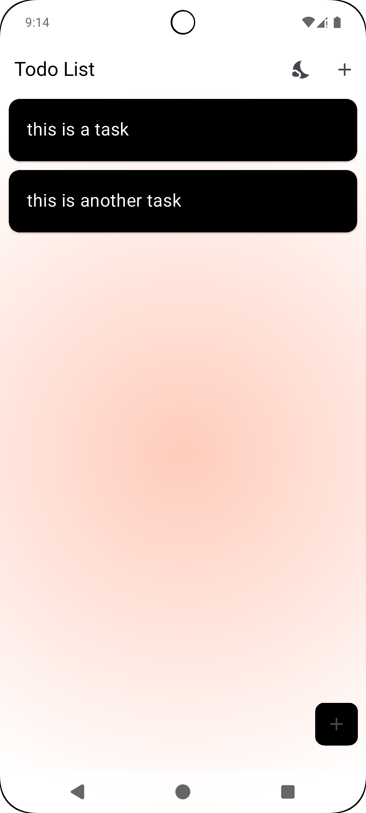
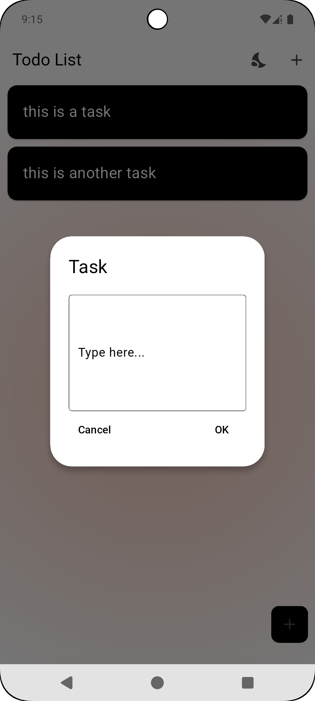

📝 Minimalist ToDo List App

A clean, distraction-free ToDo app built to help you focus on what matters.
Simple design, smooth user experience, and core features only — no clutter.

✨ Features
✅ Add, edit, and delete tasks effortlessly

📌 Mark tasks as complete/incomplete

🌓 Light & dark mode for comfortable viewing

💾 Local storage — your tasks stay saved

📱 Responsive design — works great on mobile & desktop

<h2>📸 Screenshots</h2>

  
  

Material Design or custom minimalist design

📄 Usage
Open the app

Tap “+”

Type your task and save

Swipe to delete

🎯 Philosophy
This app was built to be:

Minimal — focus only on adding & completing tasks

Fast — lightweight & quick to load

Beautiful — clean design that feels good to use